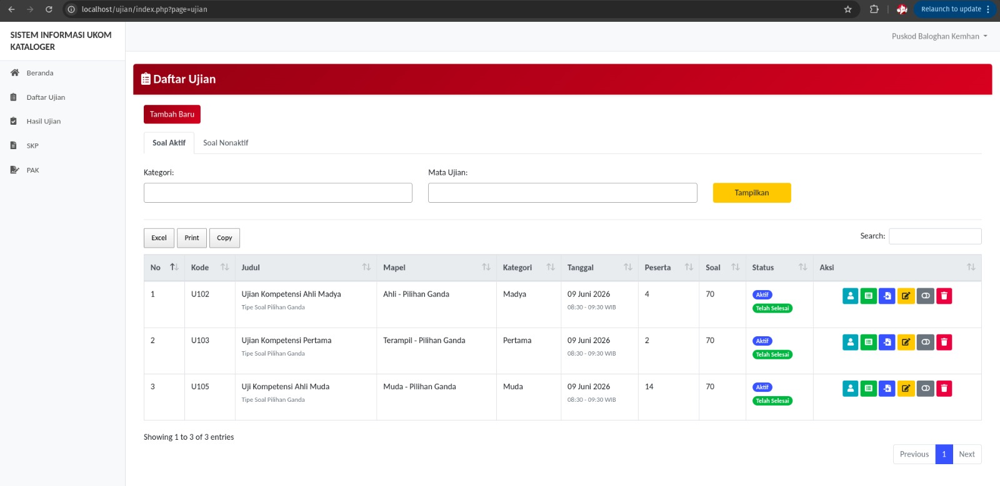

# Sistem Informasi UKOM Kataloger

Sistem Informasi UKOM Kataloger adalah aplikasi ujian online berbasis PHP native dan MySQL yang digunakan untuk mengelola proses ujian dari sisi admin, pengawas/guru, dan peserta. Aplikasi ini juga dilengkapi modul pendukung seperti pengolahan hasil ujian, SKP, dan PAK dalam satu dashboard terintegrasi.

README ini ditulis khusus untuk project ini agar siap dibagikan ke GitHub dan lebih mudah dipahami saat orang lain melihat source code Anda.

## Preview Aplikasi

Tampilan berikut adalah halaman daftar ujian pada sisi pengawas/guru:



## Tentang Aplikasi

Aplikasi ini dipakai untuk:

- mengelola data peserta ujian
- mengelola data pengawas
- mengelola klasifikasi/kategori peserta
- mengelola mata ujian
- membuat jadwal ujian
- mengatur peserta pada setiap ujian
- mengelola soal pilihan ganda dan essay
- memfasilitasi pelaksanaan ujian online
- merekap dan mengekspor hasil ujian
- mengelola modul SKP dan PAK

Nama aplikasi di tampilan admin disimpan secara dinamis melalui tabel `aplikasi`, sedangkan tampilan sidebar dan halaman login saat ini menggunakan nama:

`Sistem Informasi UKOM Kataloger`

## Fitur Utama

### 1. Multi Role Login

Aplikasi memiliki 3 jenis pengguna:

- `admin`
- `guru` / `pengawas`
- `siswa` / `peserta`

Setelah login, pengguna akan diarahkan ke dashboard sesuai hak akses masing-masing.

### 2. Manajemen Master Data

Admin dapat mengelola data utama aplikasi seperti:

- data pengawas
- data peserta ujian
- klasifikasi/kategori
- mata ujian
- profil aplikasi

### 3. Manajemen Ujian

Pengawas/guru dapat:

- membuat ujian baru
- mengatur tanggal, jam, dan durasi ujian
- menentukan mata ujian dan kategori peserta
- mengaktifkan atau menonaktifkan ujian
- memilih peserta yang berhak mengikuti ujian

### 4. Bank Soal

Sistem mendukung:

- soal pilihan ganda
- soal essay
- upload gambar pada soal
- penyalinan soal antar ujian
- import soal

### 5. Pelaksanaan Ujian Online

Pada sisi peserta, aplikasi sudah mendukung:

- validasi bahwa peserta memang terdaftar di ujian
- validasi waktu mulai dan waktu selesai ujian
- timer ujian
- progress bar jumlah soal terjawab
- nomor soal interaktif
- tombol selesai ujian

### 6. Auto Save dan Resume Ujian

Salah satu fitur penting di aplikasi ini adalah mekanisme ujian yang lebih aman untuk peserta:

- jawaban tersimpan otomatis saat peserta memilih jawaban
- jawaban essay disimpan bertahap
- peserta dapat melanjutkan ujian jika sempat keluar atau login ulang
- sistem mengarahkan peserta kembali ke ujian yang masih aktif
- soal yang belum dijawab diprioritaskan untuk dilanjutkan

### 7. Hasil Ujian

Sistem menyediakan pengolahan hasil ujian untuk admin, guru, dan siswa, termasuk:

- melihat hasil ujian
- cetak hasil
- export PDF
- export Excel
- lihat detail soal dan jawaban

### 8. Modul Tambahan

Selain modul ujian, project ini juga memiliki modul:

- `SKP`
- `PAK`

Modul tersebut tersedia pada beberapa level pengguna dan menjadi bagian dari aplikasi utama.

## Alur Pengguna

### Admin

Admin bertugas mengatur data utama sistem dan memantau keseluruhan pelaksanaan ujian.

Fitur yang terlihat dari source code:

- dashboard statistik
- data pengawas
- data peserta ujian
- klasifikasi
- mata ujian
- hasil ujian
- SKP
- PAK
- pengaturan aplikasi

### Guru / Pengawas

Guru atau pengawas bertugas menyiapkan dan memonitor ujian.

Fitur yang tersedia:

- daftar ujian
- tambah ujian
- atur peserta ujian
- input soal pilihan ganda
- input soal essay
- import soal
- salin soal
- lihat hasil ujian
- edit nilai
- export hasil

### Siswa / Peserta

Peserta menggunakan aplikasi untuk:

- login
- melihat ujian yang tersedia
- mulai ujian
- menjawab soal
- menyimpan jawaban otomatis
- melanjutkan ujian yang belum selesai
- melihat hasil ujian

## Teknologi yang Digunakan

Project ini menggunakan stack yang sederhana dan langsung:

- PHP native
- MySQL / MariaDB
- Bootstrap 4
- jQuery
- DataTables
- Select2
- Chart.js
- FPDF

## Struktur Folder Penting

```text
.
├── index.php
├── login.php
├── logout.php
├── config/
│   ├── database.php
│   ├── siswa_ujian_aktif.php
│   └── ujian_soal.php
├── pages/
│   ├── admin/
│   ├── guru/
│   └── siswa/
├── vendor/
├── img/
├── css/
├── screenshot.jpeg
├── db_ujian_online (1).sql
└── README.md
```

Penjelasan singkat:

- `index.php` adalah router utama setelah login
- `login.php` adalah halaman autentikasi pengguna
- `config/database.php` berisi koneksi database
- `config/siswa_ujian_aktif.php` berisi logic pengecekan ujian aktif peserta
- `pages/admin` berisi modul admin
- `pages/guru` berisi modul pengawas/guru
- `pages/siswa` berisi modul peserta

## Instalasi Lokal

Berikut langkah menjalankan project ini di komputer lokal:

1. Pindahkan folder project ke web root, misalnya `htdocs` atau `/var/www/html`.
2. Buat database baru dengan nama `db_ujian_online`.
3. Import file [db_ujian_online (1).sql](/var/www/html/ujian/db_ujian_online%20(1).sql) ke database tersebut.
4. Sesuaikan konfigurasi di [config/database.php](/var/www/html/ujian/config/database.php).
5. Pastikan PHP dan MySQL berjalan normal.
6. Buka aplikasi melalui browser, misalnya `http://localhost/ujian`.

Contoh isi konfigurasi database saat ini:

```php
$host = "localhost";
$user = "root";
$password = "lkjsdfjfjf";
$db = "db_ujian_online";
```

Jika ingin dibagikan ke GitHub, sangat disarankan untuk mengganti kredensial tersebut dengan konfigurasi lokal yang aman atau memindahkannya ke file environment.

## Akun Login Contoh

Berdasarkan isi dump database, tersedia akun admin berikut:

- Username: `admin`
- Password: `admin`

Catatan:

- password di database lama masih menggunakan hash `md5`
- untuk akun guru dan siswa, data juga tersedia di dump SQL
- sebaiknya akun contoh dicek ulang sebelum project dipublikasikan

## Fitur Khusus yang Sudah Terlihat di Source Code

Beberapa behavior yang cukup menarik dari aplikasi ini:

- peserta yang sedang berada dalam jadwal ujian aktif akan diarahkan otomatis ke ujian yang sedang berjalan
- peserta yang sudah pernah menyelesaikan ujian tertentu akan diblokir untuk mengerjakan ulang
- sistem memakai progress ujian real-time berdasarkan data di tabel `hasil`
- urutan soal dapat dipertahankan dalam session saat peserta melanjutkan ujian
- aplikasi menyediakan export hasil ke PDF dan Excel
- dashboard admin menampilkan statistik jumlah pengawas, peserta, klasifikasi, dan mata ujian

## Catatan Penting Sebelum Upload ke GitHub

Sebelum project ini dipublikasikan, ada beberapa hal yang sebaiknya diperhatikan:

- file `README.md` lama bawaan template sudah tidak relevan dan sudah diganti penuh
- konfigurasi database masih hardcoded
- password masih menggunakan `md5`
- project belum memakai struktur framework modern
- validasi dan keamanan input masih bisa ditingkatkan
- beberapa dependency frontend berasal dari file vendor lokal dan sebagian dari CDN

## Saran Pengembangan Selanjutnya

Kalau nanti ingin project ini terlihat lebih profesional di GitHub atau lebih aman untuk dipakai production, langkah berikut bisa dipertimbangkan:

- pindahkan konfigurasi sensitif ke `.env`
- gunakan `password_hash()` dan `password_verify()`
- tambahkan proteksi CSRF
- rapikan pemisahan logic, tampilan, dan query database
- tambahkan screenshot aplikasi pada README
- tambahkan panduan deployment
- tambahkan lisensi project yang jelas bila akan dibagikan publik

## Lisensi

Project ini memiliki file [LICENSE](/var/www/html/ujian/LICENSE). Jika Anda ingin membagikannya secara publik, pastikan lisensi tersebut memang sesuai dengan kebutuhan Anda.

## Penutup

Project ini sudah memiliki fondasi yang cukup lengkap untuk aplikasi ujian online internal, terutama karena alur admin, pengawas, dan peserta sudah terpisah dengan jelas. Dokumentasi ini dibuat agar repository GitHub Anda terlihat lebih rapi, lebih jelas, dan lebih mudah dipahami oleh orang lain maupun oleh Anda sendiri di kemudian hari.

